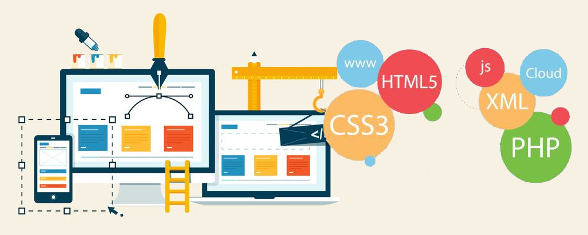

## Introduction to Web Development Outline
The repository contains overview of what is expected to
be taught to beginners who express interest in mastering
modern web development languages, tools and art. The classes, workshop,
meetings are not bound to contents listed in this repo, but
rather, a guide to the minimal information to be teach, and
expected of each member of **Kwasu Tech Community** who is into
Web development. This repo will be continuously developed, as
technology itself is ever-changing.

## Paths
Anyone can choose any path that interests them: you can choose
to follow through as front-end Engineer, or a Backend Engineer. However,
the Basic is expected of every member, as this serves as a foundation
for other paths. (I advise individual to choose both side, and be
a Fullstack developer :speak_no_evil: :speak_no_evil: )

- [Basics for all](basics.md)
- [Front-end Developer](front-end.md)
- [Backend Developer](backend.md)

## Contribute
If you feel like there is/are some important things we do not list here
or not touching in our meetings, don't hesitate to let us know!!
